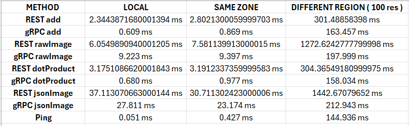

From the results we can see that the gRPC is generally faster than REST, and we can see this difference whether the servers are in the same region or different regions. There is a significant difference between operations like add and rawImage/jsonImage, with the image ones being the bigger payloads. REST sees a significant increase between add and Image operations and we observe that for gRPC as well. The reason for this is that, REST established a brand new TCP connection for every response adding a setup time where as gRPC uses just 1 connection for the whole duration. But when the server and client are located in different regions, there is significant lag with a delay of roughly 145 ms which domainates the operations. gRPC is still faster, but the cross region delay dominates the operations and significantly increases time.